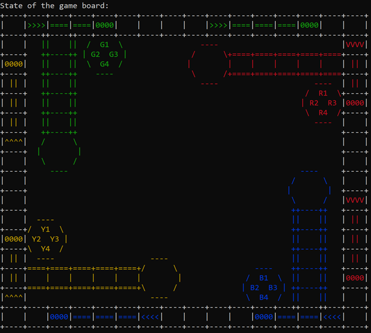
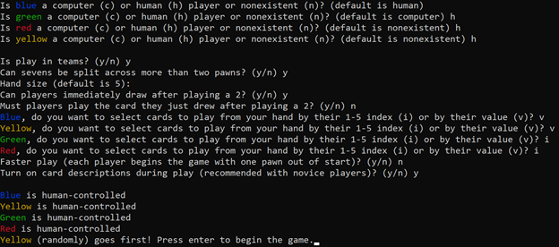

# Sorry! Boardgame

## Table of Contents
- [Sorry! Boardgame](#sorry-boardgame) 
  - [Table of Contents](#table-of-contents) 
  - [Description](#description) 
      - [Programming language(s):](#programming-languages) 
    - [Display](#display) 
      - [Examples](#examples) 
      - [UI](#ui) 
    - [Folder structure](#folder-structure) 
  - [Installation](#installation) 
  - [Usage](#usage) 
    - [Invokation](#invokation) 
  - [Contributions](#contributions) 

## Description
This program provides a method of playing the Sorry! boardgame on a computer.  
Start date: July 08, 2021  
Current version: 0.1.0  
#### Programming language(s):
- Python
	- [sorry_boardgame.py](sorry_boardgame.py) main program entrance containing all pertinent code and structures

### Display
#### Examples

#### UI

### Folder structure
| Tree with Root Having Local Path | Generation Method | Description |
| -------------------------------- | ----------------- | ----------- |
| [/Sorry-Boardgame](https://github.com/anderjef/Sorry-Boardgame) | auto-generated by Pycharm | <!-- --> |

## Installation
- Download [ZIP](https://github.com/anderjef/Sorry-Boardgame/archive/main.zip). Extract to a folder named Sorry!Boardgame.
- Download and install [Pycharm](https://www.jetbrains.com/pycharm/download/#section=windows) or other compatible integrated development environment (IDE).
- Open the project within the IDE, and use the IDE to run [sorry_boardgame.py](https://github.com/anderjef/Sorry-Boardgame/sorry_boardgame.py).

## Usage
### Invokation
1. Method 1
	- Download the appropriate [ZIP](https://github.com/anderjef/Sorry-Boardgame/archive/main.zip) then open [sorry_boardgame.py](https://github.com/anderjef/sorry_boardgame.py) with [Python (version 3.8.1 or compatible)](https://www.python.org/downloads/).
2. Method 2
	- See [Installation](#Installation).

## Contributions
- Jeffrey Andersen - developer
- [Rules reference and inspiration](https://www.hasbro.com/common/documents/dad288711c4311ddbd0b0800200c9a66/46ACC68319B9F36910005BB69E429D41.pdf)